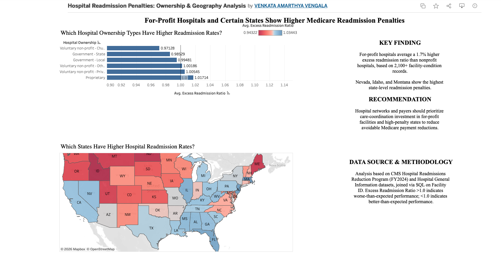

# Healthcare Readmissions Analysis

Interactive Tableau dashboard analyzing Medicare hospital readmission 
penalties using CMS public data, identifying which hospital 
characteristics and states show higher-than-expected readmission rates.

🔗 **[View Live Interactive Dashboard](https://public.tableau.com/app/profile/venkata.amarthya.vengala/viz/HospitalReadmissionPenaltiesOwnershipGeographyAnalysis/Dashboard1)**

## Business Question

Which hospital ownership types and states show the highest Medicare 
readmission penalties, and what should hospital networks/payers 
prioritize to reduce avoidable readmissions?

## Data Sources

- [CMS Hospital Readmissions Reduction Program](https://data.cms.gov/provider-data/dataset/9n3s-kdb3)
- [CMS Hospital General Information](https://data.cms.gov/provider-data/dataset/xubh-q36u)

## Approach

1. **Data cleaning & joining (SQL/SQLite)**: Imported both datasets, 
   handled data suppression values ("N/A", "Too Few to Report"), and 
   joined on Facility ID to combine readmission metrics with hospital 
   characteristics (ownership type, star rating, location).
2. **Analysis**: Aggregated excess readmission ratios by state, 
   ownership type, and condition to identify patterns.
3. **Visualization (Tableau)**: Built an interactive dashboard with a 
   choropleth map and bar chart, linked via filter actions.

## Key Findings

- **For-profit hospitals** average a 1.7% higher excess readmission 
  ratio than nonprofit hospitals (based on 2,100+ facility-condition 
  records).
- **Nevada, Idaho, and Montana** show the highest state-level 
  readmission penalties.
- Condition type (heart failure, pneumonia, etc.) was **not** a strong 
  differentiator — ownership and geography mattered more.

## Recommendation

Hospital networks and payers should prioritize care-coordination 
investment in for-profit facilities and high-penalty states to reduce 
avoidable Medicare payment reductions.

## Files

- `sql/queries.sql` — Full SQL: data cleaning, joins, aggregations
- Live dashboard link above (Tableau Public)

## Tools Used

SQL (SQLite), Tableau Public
